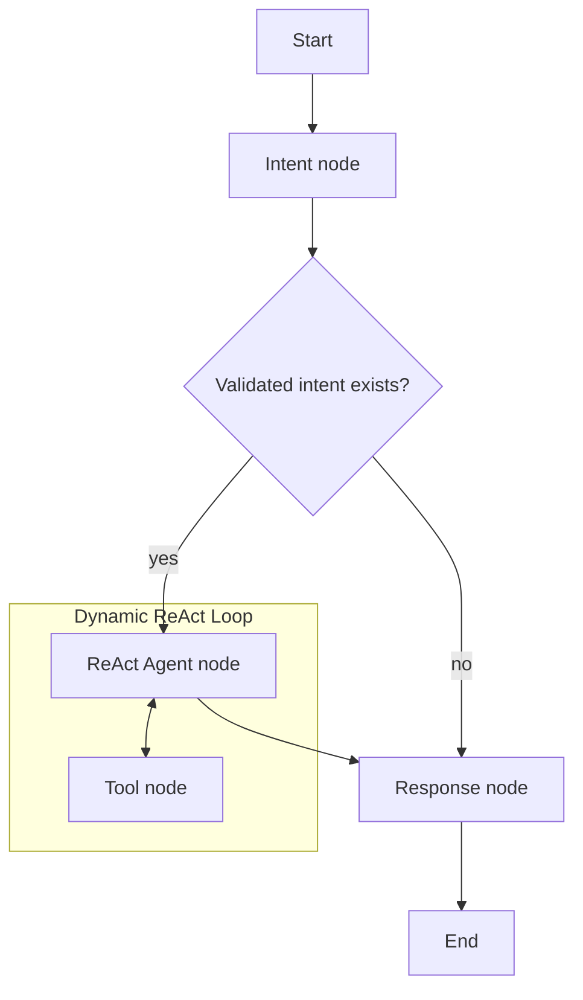

# Agent Graph Flow

This diagram reflects the current LangGraph implementation in [`../../backend/app/agents/managerial_agent.py`](../../backend/app/agents/managerial_agent.py).

## Route Behavior

- The graph starts at `intent`.
- `intent` returns `react_agent` only when `validated_intent` is present.
- `react_agent` is a high-level LangGraph agent that internally loops between LLM reasoning and tool calls.
- `response` always terminates the workflow.

## Why This Matters

The refactored graph provides several improvements over the legacy plan-and-execute model:

- **Adaptability**: The agent can react to intermediate results rather than following a static plan.
- **Error Recovery**: If a tool fails, the agent can "think" of an alternative tool or parameter.
- **Performance**: Removed the overhead of persisting complex plans in a database for every execution step.
- **State Management**: Uses an in-memory dictionary for maximum speed during the agentic loop.
