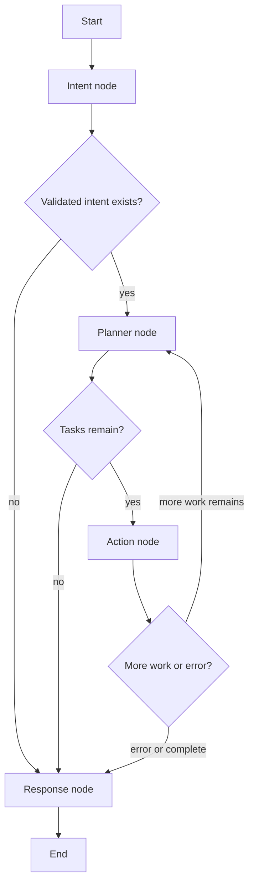

# Agent Graph Flow

This diagram reflects the current LangGraph implementation in [`../../backend/app/agents/managerial_agent.py`](../../backend/app/agents/managerial_agent.py).

## Route Behavior

- The graph starts at `intent`.
- `intent` returns `planner` only when `validated_intent` is present.
- `planner` returns `action` when tasks exist and the current task index has not reached the end.
- `action` returns `planner` when the plan still has incomplete work and returns `response` when all tracked tasks are completed or failed.
- `response` always terminates the workflow.

## Why This Matters

The graph keeps LLM reasoning and tool execution separated:

- Intent classification decides whether the request is actionable.
- Planning creates a structured task list.
- Action execution handles schema validation, tool calls, result parsing, and task status updates.
- Response generation converts the final state into user-facing text.

