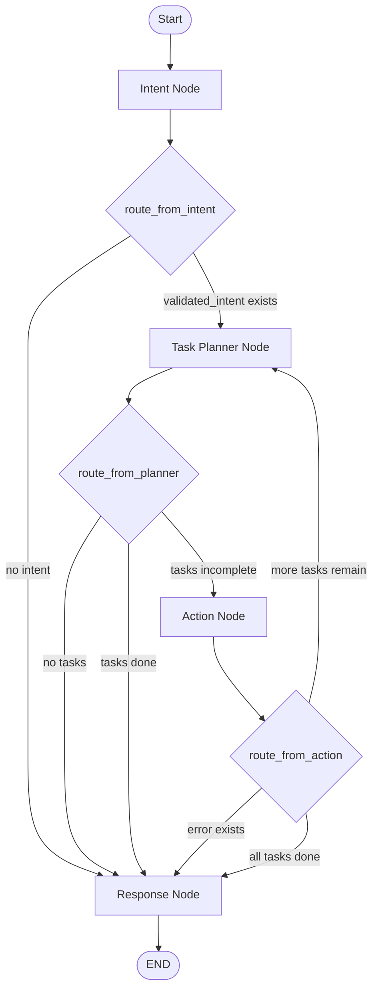

Here is the **correct Mermaid diagram** that matches your actual LangGraph flow (including intent → planner → action → response and all conditional routing):

---

### 🔥 What this diagram accurately reflects

* **Intent Node**

  * If `validated_intent` exists → Planner
  * Else → Response

* **Planner Node**

  * No tasks → Response
  * Tasks exist → Action
  * Completed → Response

* **Action Node**

  * Error → Response
  * More tasks → Planner (loop)
  * Done → Response

* **Response Node**

  * Always terminates workflow

---

If you want next level architecture, I can convert this into:

* 🔁 **true LangGraph state machine diagram (with should_continue merged)**
* ⚡ **async parallel action execution graph**
* 🧠 **multi-agent planner + executor separation (enterprise scale)**
