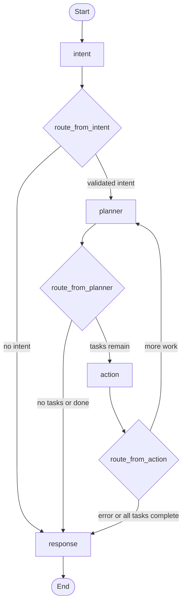

# Agent Workflow

## Summary

The agent system is implemented with LangGraph in [`../../backend/app/agents/managerial_agent.py`](../../backend/app/agents/managerial_agent.py). It turns a natural-language user request into a validated intent, a task plan, one or more integration tool calls, and a final response.

## Agent Folder Structure

```text
backend/app/
├── agents/
│   ├── managerial_agent.py    # Graph assembly and routing
│   ├── state.py               # AgentState schema
│   ├── intent_agent.py        # Intent classification node
│   ├── task_planner_agent.py  # Planning node
│   ├── action_agent.py        # Tool execution node
│   └── response_agent.py      # Final response node
├── core/
│   ├── openrouter.py          # LLM client wrapper
│   └── prompts.py             # Prompt loader/constants
└── mcp_alt/
    └── registry.py            # Tool catalog and invoke bridge
```

## Control flow (Mermaid)

This matches the compiled graph in [`../../backend/app/agents/managerial_agent.py`](../../backend/app/agents/managerial_agent.py): node IDs `intent`, `planner`, `action`, and `response`, plus conditional routers `route_from_intent`, `route_from_planner`, and `route_from_action`. A separate `should_continue` function exists in the same file but is not wired as graph edges in the current `StateGraph` setup.



For a shorter diagram-only page, see [`agent-graph-flow.md`](agent-graph-flow.md).

## Graph Nodes

### Intent Node

The intent node classifies the user's request and decides whether the request is actionable. It writes fields such as `validated_intent`, `intent_confidence`, and clarification state into `AgentState`.

If no validated intent is produced, the graph routes directly to the response node.

### Planner Node

The planner node converts the validated intent into executable tasks. It uses the MCP tool registry to understand available servers, tools, and parameter schemas. It persists execution plan data through `PlanRepository`.

Planner output includes:

- `plan_id`
- `tasks`
- `task_status`
- `execution_order`
- task arguments and tool targets

### Action Node

The action node executes tasks through the runtime MCP registry. It is responsible for:

- Resolving placeholders such as user context and prior task outputs.
- Validating task arguments against cached tool schemas.
- Invoking the selected MCP tool with the current user ID.
- Parsing raw integration output with specialized prompts.
- Updating task status in state, database records, and Redis cache.

The current action implementation includes a tool-contract layer: dynamic tool schema lookup on registry startup, JSON Schema validation before invocation, recursive placeholder substitution for user context and prior task outputs, and safe serialization of complex tool results before downstream LLM use.

### Response Node

The response node synthesizes a final answer for the user. It uses the accumulated intent, task status, task results, errors, and chat history. It always terminates the graph.

## Routing

The graph entrypoint is `intent`. Conditional routing then decides the next node:

- `intent` routes to `planner` when `validated_intent` exists, otherwise `response`.
- `planner` routes to `action` when tasks remain, otherwise `response`.
- `action` routes back to `planner` when additional plan work remains, otherwise `response`.
- `response` routes to `END`.

The Mermaid diagram in the section above is the canonical flow for this document; [`agent-graph-flow.md`](agent-graph-flow.md) is a minimal variant for quick reference.

## Agent State

`AgentState` carries request context and execution state across nodes. Important fields include:

- User and session context: `user_id`, `google_id`, `user_context`, `session_id`.
- Conversation context: `user_input`, `chat_history`.
- Intent output: `validated_intent`, `intent_confidence`, `needs_clarification`, `clarification_question`.
- Plan output: `plan_id`, `tasks`, `task_status`, `execution_order`, `current_task_index`.
- Execution output: `completed_tasks`, `failed_tasks`, `task_results`, `results`.
- Finalization: `final_response`, `error`, `iteration`, `max_iterations`.

The chat endpoint initializes this state before calling the graph.

## LLM Usage

The implementation uses OpenRouter through [`../../backend/app/core/openrouter.py`](../../backend/app/core/openrouter.py). Model selection and fallback behavior are configured with environment variables in [`../../backend/app/config.py`](../../backend/app/config.py).

Prompt files are loaded from [`../../backend/system_prompts`](../../backend/system_prompts), keeping prompt text separate from Python orchestration logic.

## Persistence and Audit Behavior

The agent nodes receive repository dependencies when the graph is constructed:

- `PlanRepository` for execution plans and task status.
- `UserRepository` for user context.
- `AuditRepository` for audit trail behavior.

The REST chat route persists the final user/agent messages through `ChatHistoryRepository`. Plan and task state can also be cached in Redis for faster status access during execution.

## Execution Limits and Failures

The graph uses `MAX_EXECUTION_ITERATIONS` from settings to avoid unbounded loops. If an error is present in state, routing moves to the response node so the user receives a final message rather than a silent failure.

Tool invocation has a timeout in the action node. Failed validation or tool errors mark the task as failed and keep the rest of the workflow deterministic.

