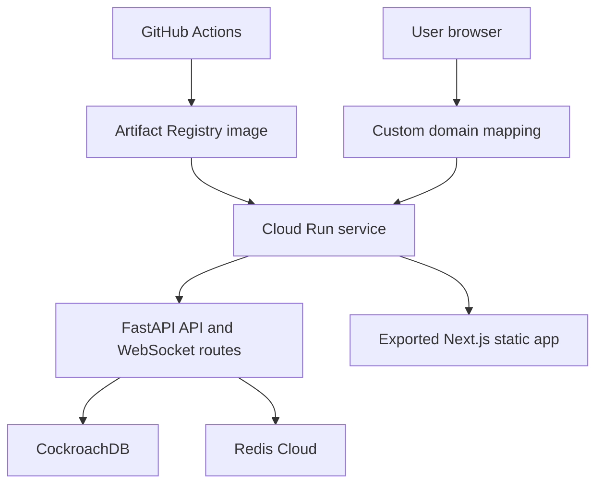

# Deployment

## Summary

The current production deployment path is Google Cloud Run with one service. The service runs FastAPI and serves the exported Next.js frontend from the same container.

## Deployment Folder Structure

```text
personal-ai-agent/
├── Dockerfile                         # Multi-stage build: frontend + backend
├── .dockerignore                      # Build context exclusions
├── .github/
│   └── workflows/
│       └── deploy-cloud-run.yml       # Test, build, push, deploy pipeline
├── backend/
│   ├── README.md                      # Backend/deploy operational notes
│   ├── app/                           # FastAPI runtime code
│   └── alembic/                       # DB migrations
└── frontend/
    ├── next.config.mjs                # Static export settings
    └── package.json
```

## Chosen Deployment Model

The project uses the single-service Cloud Run option:



This keeps browser requests same-origin:

- Frontend pages are served by FastAPI from `static/`.
- REST API calls use `/api/v1/...`.
- WebSocket chat uses `/ws/chat`.

## Docker Image

The root Dockerfile is multi-stage:

1. `node:20-slim` installs frontend dependencies and runs `npm run build`.
2. `python:3.11-slim` installs `uv` and backend dependencies with `uv sync --frozen --no-dev --no-install-project`.
3. Backend code, Alembic files, system prompts, and exported frontend assets are copied into `/app`.
4. The container starts uvicorn on Cloud Run's `PORT`, defaulting to `8080`.

The image command is:

```bash
uvicorn app.main:app --host 0.0.0.0 --port ${PORT:-8080}
```

## GitHub Actions

The workflow in [`../../.github/workflows/deploy-cloud-run.yml`](../../.github/workflows/deploy-cloud-run.yml) has three jobs:

- `backend-tests`: installs backend dependencies and runs the health integration test.
- `container-build`: verifies the Docker build on pull requests and pushes.
- `deploy`: authenticates to Google Cloud, builds and pushes the image to Artifact Registry, generates a Cloud Run env file, and deploys the service.

Deployment is skipped for pull requests and runs for `main` pushes or manual workflow dispatch.

Google Cloud authentication uses Workload Identity Federation rather than a long-lived JSON key.

## One-Time GCP Setup

Create these resources once before relying on the GitHub Actions deploy job.

### 1) Set base variables

```bash
export PROJECT_ID="your-gcp-project-id"
export REGION="us-central1"
export GAR_REPOSITORY="personal-ai-agent"
export SERVICE_NAME="personal-ai-agent"
export SA_NAME="github-actions-deployer"
export SA_EMAIL="${SA_NAME}@${PROJECT_ID}.iam.gserviceaccount.com"
export GITHUB_OWNER="your-github-username-or-org"
export GITHUB_REPO="personal-ai-agent"
export WIF_POOL="github-pool"
export WIF_PROVIDER="github-provider"
```

### 2) Enable required APIs

```bash
gcloud services enable \
  artifactregistry.googleapis.com \
  run.googleapis.com \
  iam.googleapis.com \
  iamcredentials.googleapis.com \
  cloudresourcemanager.googleapis.com
```

### 3) Create Artifact Registry repository (`GAR_REPOSITORY`)

```bash
gcloud artifacts repositories create "${GAR_REPOSITORY}" \
  --repository-format=docker \
  --location="${REGION}" \
  --description="Docker images for ${SERVICE_NAME}"
```

### 4) Create deployer service account (`GCP_SERVICE_ACCOUNT`)

```bash
gcloud iam service-accounts create "${SA_NAME}" \
  --display-name="GitHub Actions Cloud Run Deployer"
```

Grant deployment permissions:

```bash
gcloud projects add-iam-policy-binding "${PROJECT_ID}" \
  --member="serviceAccount:${SA_EMAIL}" \
  --role="roles/run.admin"

gcloud projects add-iam-policy-binding "${PROJECT_ID}" \
  --member="serviceAccount:${SA_EMAIL}" \
  --role="roles/artifactregistry.writer"

gcloud projects add-iam-policy-binding "${PROJECT_ID}" \
  --member="serviceAccount:${SA_EMAIL}" \
  --role="roles/iam.serviceAccountUser"
```

### 5) Create Workload Identity Federation provider (`GCP_WORKLOAD_IDENTITY_PROVIDER`)

```bash
gcloud iam workload-identity-pools create "${WIF_POOL}" \
  --location="global" \
  --display-name="GitHub Actions Pool"
```

```bash
gcloud iam workload-identity-pools providers create-oidc "${WIF_PROVIDER}" \
  --location="global" \
  --workload-identity-pool="${WIF_POOL}" \
  --display-name="GitHub OIDC Provider" \
  --issuer-uri="https://token.actions.githubusercontent.com" \
  --attribute-mapping="google.subject=assertion.sub,attribute.repository=assertion.repository,attribute.ref=assertion.ref"
```

Allow your GitHub repository to impersonate the service account:

```bash
gcloud iam service-accounts add-iam-policy-binding "${SA_EMAIL}" \
  --role="roles/iam.workloadIdentityUser" \
  --member="principalSet://iam.googleapis.com/projects/$(gcloud projects describe ${PROJECT_ID} --format='value(projectNumber)')/locations/global/workloadIdentityPools/${WIF_POOL}/attribute.repository/${GITHUB_OWNER}/${GITHUB_REPO}"
```

Get provider resource name (use this value for `GCP_WORKLOAD_IDENTITY_PROVIDER`):

```bash
echo "projects/$(gcloud projects describe ${PROJECT_ID} --format='value(projectNumber)')/locations/global/workloadIdentityPools/${WIF_POOL}/providers/${WIF_PROVIDER}"
```

### 6) Optional: domain mapping and DNS

Create mapping:

```bash
gcloud run domain-mappings create \
  --service "${SERVICE_NAME}" \
  --domain "api.yourdomain.com" \
  --region "${REGION}"
```

Retrieve DNS records to add at your DNS provider:

```bash
gcloud run domain-mappings describe \
  --domain "api.yourdomain.com" \
  --region "${REGION}"
```

## Runtime Services

### Database

The current database target is CockroachDB. The backend supports:

- `DATABASE_URL`, preferred for hosted CockroachDB.
- Individual `POSTGRES_*` values for Postgres-compatible configuration.

Migrations should be run from a controlled environment such as a one-off admin command or a gated GitHub Actions job. They should not run automatically on every container start.

### Redis

The current cache target is Redis Cloud. Use `REDIS_URL`, preferably with `rediss://` when TLS is required by the provider.

### Domain

The deployment assumes Cloud Run domain mapping. After mapping the custom domain, set:

- `HOST`
- `CORS_ORIGINS`
- `ALLOWED_HOSTS`

These should point to the deployed custom domain and any explicitly allowed local/test origins.

## GitHub Variables and Secrets

Repository variables are used for non-secret deployment and provider identifiers:

- `GCP_PROJECT_ID`
- `GCP_REGION`
- `GAR_REPOSITORY`
- `CLOUD_RUN_SERVICE`
- `GCP_WORKLOAD_IDENTITY_PROVIDER`
- `GCP_SERVICE_ACCOUNT`
- `HOST`
- `CORS_ORIGINS`
- `ALLOWED_HOSTS`
- `NEXT_PUBLIC_GOOGLE_CLIENT_ID`
- `MY_GITHUB_CLIENT_ID`
- `NOTION_CLIENT_ID`
- `GOOGLE_CLIENT_ID`
- `GOOGLE_OAUTH_SCOPES`
- `OPENROUTER_BASE_URL`
- `OPENROUTER_DEFAULT_MODEL`
- `OPENROUTER_FALLBACK_MODELS`

Repository secrets are used for runtime credentials:

- `DATABASE_URL`, or individual `POSTGRES_*` secrets.
- `REDIS_URL`
- `SECRET_KEY`
- `MY_GITHUB_CLIENT_SECRET`
- `NOTION_CLIENT_SECRET`
- `GOOGLE_CLIENT_SECRET`
- `OPENROUTER_API_KEY`

Do not commit real tokens or private keys to `.env.example`, docs, or workflow files.

## Manual Deployment Shape

GitHub Actions automates deployment, but the equivalent manual shape is:

```bash
docker build -t REGION-docker.pkg.dev/PROJECT/REPOSITORY/SERVICE:latest .
docker push REGION-docker.pkg.dev/PROJECT/REPOSITORY/SERVICE:latest
gcloud run deploy SERVICE \
  --image REGION-docker.pkg.dev/PROJECT/REPOSITORY/SERVICE:latest \
  --region REGION \
  --allow-unauthenticated \
  --port 8080
```

## Deployment Caveats

- Cloud Run supports WebSockets, but request timeout and client reconnection behavior should be reviewed for long-running sessions.
- CockroachDB and Redis Cloud must allow network access from Cloud Run. If strict IP allowlisting is enabled, a stable egress pattern may be needed.
- The Docker daemon was not running during the last local verification, so the Docker build was not validated locally; the GitHub Actions runner is expected to perform that check.
- Static export means the frontend cannot depend on Next.js server runtime behavior in production.

