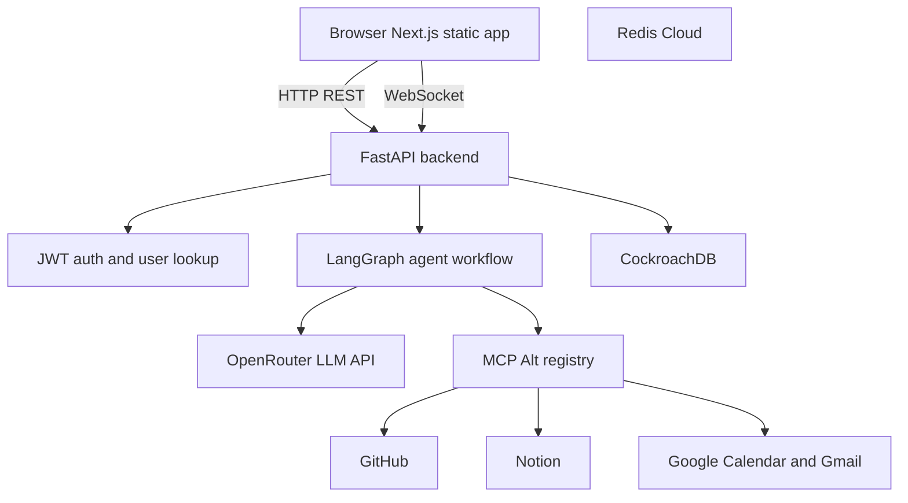

# Personal AI Agent - Current Implementation

## Purpose

Personal AI Agent is a full-stack productivity assistant that accepts natural-language requests, plans the work with a LangGraph-based agent workflow, executes tool calls against connected services, and returns a useful response through a web interface.

The current implementation is a monorepo with:

- A FastAPI backend in [`../../backend`](../../backend) for APIs, authentication, persistence, agent orchestration, MCP-style tools, Redis caching, and static frontend serving.
- A Next.js frontend in [`../../frontend`](../../frontend) for sign-in, chat, integrations, plans, activity, and settings.
- A single-service Cloud Run deployment path using the root [`../../Dockerfile`](../../Dockerfile), external CockroachDB, Redis Cloud, and GitHub Actions.

This folder is the reviewer-facing source of truth for the current implementation. Historical design notes remain under [`../development-progress`](../development-progress).

## Repository Folder Structure

```text
personal-ai-agent/
├── frontend/                  # Next.js application
│   ├── app/
│   ├── components/
│   ├── lib/
│   └── package.json
├── backend/                   # FastAPI application
│   ├── app/
│   │   ├── agents/           # LangGraph agents
│   │   ├── api/              # FastAPI routes and websocket
│   │   ├── core/             # Settings, prompts, LLM client
│   │   ├── db/               # Models, repositories, sessions
│   │   ├── mcp_alt/          # Runtime MCP servers and registry
│   │   ├── services/         # Cache and user-facing services
│   │   └── utils/            # Shared helpers
│   ├── alembic/              # Database migrations
│   └── pyproject.toml
├── project-docs/
│   ├── final-implementation/ # Reviewer-facing documentation
│   └── development-progress/ # Historical design/progress notes
├── .github/
│   └── workflows/            # CI/CD pipelines
├── Dockerfile
└── .dockerignore
```

## Implemented Capabilities

- Google sign-in that exchanges a Google ID token for an application JWT stored in an httpOnly `access_token` cookie.
- Authenticated API access through FastAPI middleware and route dependencies.
- Chat endpoint that creates or validates sessions, loads chat history, invokes the LangGraph agent, and stores user/agent messages.
- Agent workflow with intent classification, dynamic ReAct reasoning, tool execution, and response synthesis.
- MCP-style integrations for GitHub, Notion, Google Calendar, and Gmail.
- User-scoped integration credential storage for OAuth-connected services.
- Persistence for users, sessions, chat history, audit logs, and MCP credentials.
- Static Next.js export served by FastAPI in production, allowing one Cloud Run service to host both frontend and backend.
- WebSocket chat route for streaming graph steps, with REST chat as the safer baseline path.
- Cloud Run deployment workflow through GitHub Actions, Artifact Registry, CockroachDB, Redis Cloud, and custom domain mapping.

## Current Architecture



The backend entrypoint is [`../../backend/app/main.py`](../../backend/app/main.py). It registers middleware, API routers, WebSocket routes, health checks, and the static frontend catch-all. The frontend export is copied into `static/` inside the Cloud Run image.

## Main Runtime Flow

1. The user signs in through the Next.js UI using Google OAuth.
2. The frontend posts the Google credential to `POST /api/v1/auth/google`.
3. FastAPI verifies the Google ID token, creates or loads the user, issues an application JWT, and sets the `access_token` cookie.
4. The user submits a chat message from the chat UI.
5. The backend creates or validates a session, loads chat history, builds `AgentState`, and invokes the LangGraph workflow.
6. The graph classifies intent, executes a dynamic ReAct agent loop for tool calls, and synthesizes the final response.
7. The backend persists the user message and agent response, then returns the response and `session_id`.

## Documentation Index

- [`backend-architecture.md`](backend-architecture.md): FastAPI app, middleware, routers, auth, persistence, and services.
- [`agent-workflow.md`](agent-workflow.md): LangGraph nodes, routing, state, tool execution, and response generation.
- [`agent-graph-flow.md`](agent-graph-flow.md): concise Mermaid diagram of the implemented graph.
- [`integrations-and-mcp.md`](integrations-and-mcp.md): GitHub, Notion, Google Calendar, Gmail, OAuth, credentials, and MCP registry details.
- [`frontend-implementation.md`](frontend-implementation.md): Next.js app structure, API client, auth UX, chat, state, and static export.
- [`deployment.md`](deployment.md): Cloud Run option A deployment, Docker, GitHub Actions, env vars, CockroachDB, Redis Cloud, and domain mapping.
- [`testing-and-quality.md`](testing-and-quality.md): tests, verification commands, quality checks, known caveats, and retired implementation notes.

## Current Technology Stack

- Backend: FastAPI, Python 3.11, async SQLAlchemy, asyncpg, Alembic, Redis, PyJWT, Google Auth, LangGraph, OpenRouter, FastMCP-style integration wrappers.
- Frontend: Next.js 14 App Router, React 18, Zustand, Sonner, Tailwind CSS, Google OAuth.
- Persistence and cache: CockroachDB-compatible Postgres connection and Redis Cloud.
- Deployment: Docker, Google Cloud Run, Artifact Registry, GitHub Actions with Workload Identity Federation.

## Reviewer Quick Start

For local development, start with the root [`../../README.md`](../../README.md) and backend [`../../backend/README.md`](../../backend/README.md). The most useful reviewer checks are:

```bash
cd backend
uv sync --all-groups
uv run pytest tests/integration/test_health.py -q
```

```bash
cd frontend
npm run build
```

The full deployed shape is documented in [`deployment.md`](deployment.md). The local Docker image could not be validated in the last implementation session because the Docker daemon was not running on the machine, but the Dockerfile and CI workflow are in place for GitHub-hosted runners.
