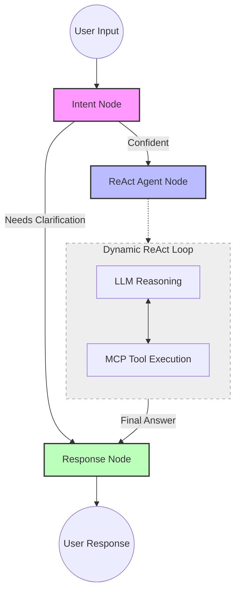

# ReAct Agent Architecture Documentation

This document outlines the refactored agentic flow of the Personal AI Agent, moving from a static "Plan-and-Execute" model to a dynamic **ReAct (Reason + Act)** loop.

## Overview

The new architecture leverages **LangGraph's `create_react_agent`** to provide a more resilient and adaptive agent. Instead of generating a full task list at the start, the agent now reasons through the problem step-by-step, deciding which tool to call based on the results of previous actions.

## Core Components

### 1. Intent Classifier (Pre-processor)
The flow begins with the **Intent Node**. It analyzes the raw user input to:
- Determine if the request is actionable.
- Extract high-level intent and confidence scores.
- Trigger clarification questions if the request is ambiguous.

### 2. ReAct Agent (Dynamic Loop)
The heart of the system is the **ReAct Agent Node**. This node dynamically:
1. **Reasons**: Analyzes the current state and conversation history.
2. **Acts**: Selects and executes one or more tools from the **MCP Toolset** (GitHub, Gmail, etc.).
3. **Observes**: Incorporates the tool's output back into its reasoning process.
4. **Repeats**: Continues the loop until it has sufficient information to answer the user.

### 3. Response Aggregator (Post-processor)
Once the ReAct agent completes its work, the **Response Node** takes over to:
- Consolidate all tool outputs.
- Format the final answer in a user-friendly, conversational tone.
- Handle error states if the agent fails to reach a conclusion.

---

## Agentic Flow Diagram

---

## Technical Implementation Details

### Tool Wrapping
All MCP tools are dynamically converted into LangChain **`StructuredTool`** objects. This allows the ReAct agent to:
- Understand tool schemas (parameters, descriptions).
- Use built-in LangChain error handling.
- Maintain a clean separation between the agent logic and the underlying MCP server implementations.

### Latency Optimizations
- **In-Memory State**: By using local Python dictionaries instead of Redis, the agent can update its "thought process" with sub-millisecond latency.
- **Async Execution**: The entire graph operates asynchronously, ensuring the UI remains responsive even during complex tool calls.
